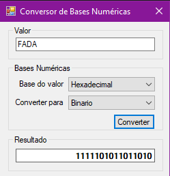

# Conversor de Bases Numéricas 

Aplicação que converte um número informado pelo usuário, especificando sua base, para outras bases núméricas.

## Funcionalidades



- Aplicação Windows
- Conversões disponíveis entre as bases: decimal, binária, octal e hexadecimal

## Tecnologias
  - C#
  - Windows Forms
  - .NET Framework 4.7.2
  
## Rodando localmente

Instale as dependências

```bash
    https://dotnet.microsoft.com/en-us/download/dotnet-framework/net472
```

Clone o projeto

```bash
  https://github.com/Je0225/Conversor-de-bases-numericas.git
```

Entre no diretório do projeto e Execute o programa

```bash
  \ConversorParaBinario\bin\Debug\ConversorParaBinario.exe
```
